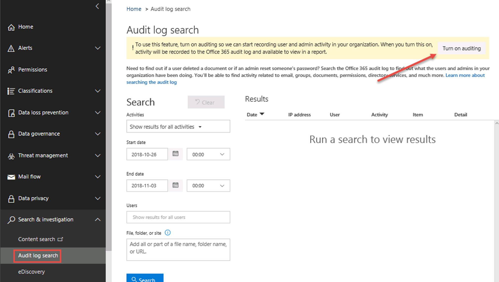

# Microsoft 365 Cloud App Security
[🔙](#introduction)

This lab will guide you through some of the Microsoft Cloud App Security
(MCAS) capabilities.

We expect you to already have experience with MCAS deployment and
configuration. In the different sections, you will be asked to fulfill
some tasks for which you will receive the requirements but not a step by
step guide to accomplish this task. A lab answer key document can be
provided to those needing it.

Most treat detections capabilities rely on auditing being enabled in your environment.By default, auditing is not enabled in Office 365 and must be turned on using the **Security & Compliance** admin console. In addition, some applications like Exchange Online require extra configuration, like enabling auditing per mailbox ([https://docs.microsoft.com/en-us/office365/securitycompliance/enable-mailbox-auditing?redirectSourcePath=%252fen-us%252farticle%252fenable-mailbox-auditing-in-office-365-aaca8987-5b62-458b-9882-c28476a66918](https://docs.microsoft.com/en-us/office365/securitycompliance/enable-mailbox-auditing?redirectSourcePath=%252fen-us%252farticle%252fenable-mailbox-auditing-in-office-365-aaca8987-5b62-458b-9882-c28476a66918)).

As this operation can take up to 24h, your instructor will provide you access to another environment to review the alerts.

The main sections covered in this Lab are:

- [Cloud Discovery](#cloud-discovery)
- [Threat Detection](#threat-detection)
- [Conditional Access App Control](#conditional-access-app-control)
- [Management](#management)
- [Information Protection](#information-protection)
---
# Connect MCAS to Office 365 
[🔙](#microsoft-365-cloud-app-security)

1. On Client01, open a new tab and go to **https://portal.cloudappsecurity.com**
1. Go to the gear icon and select **App connectors** 

	
 
1. Click on the **+** button and select Office 365 
 
	
1. Click on **Connect Office 365**
 
	
1. Click on **Test now** to validate the configuration 
 
	