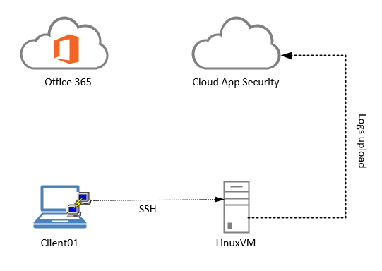

# Microsoft Cloud App Security

This lab will guide you through the different Microsoft Cloud App Security (MCAS) capabilities.
Although some labs are pretty straight forward ,we expect you to already have some basic experience with Cloud App Security or Office 365 management.

## Lab environment

* Client01 is a Windows 10 VM that will be used to access Office 365 and Cloud app Security management consoles and configure the log collector running on LinuxVM, using Putty.
* LinuxVM is an Ubuntu 18.04 computer on which we install Docker to run the Cloud App Security Discovery log collector.
* Office 365 and Cloud App Security are test tenants for the labs.

>:memo: We recommend using the [Cloud App Security documentation](https://docs.microsoft.com/en-us/cloud-app-security/what-is-cloud-app-security "Cloud App Security documentation") to have details on the different use cases, capabilities and configuration steps.

---

## Labs

>:warning::warning::warning: Before going to the different labs section, please complete the **[environment preparation](mcas_lab_preparation.md)**. :warning::warning::warning:

The different Cloud App Security capabilities covered in the labs are:

* [Module 01 - Management](module01/module01.md)
* [Module 02 - Cloud Discovery continuous report](module02/module02.md)
* [Module 03 - Information protection](module03/module03.md)
* [Module 04 - Threat detection](module04/module04.md)
<<<<<<< HEAD

### Optional/followon on labs:

* [Module 05a - Management with PowerShell](module05a/module05a.md)
* [Module 05b - Cloud Discovery snapshot report](module05b/module05b.md)
* [Module 05c - Log collector troubleshooting](module05b/module05c.md)
* [Module 05d - Conditional Access App Control](module05b/module05d.md)
=======
* [Module 05a - Management with PowerShell](module05/module05a.md)
* [Module 05b - Cloud Discovery snapshot report](module05/module05b.md)
* [Module 05c - Log collector troubleshooting](module05/module05c.md)
* [Module 05d - Conditional Access App Control](module05/module05d.md)
>>>>>>> 68703145288ca909ce2e8dfdb978cf1e4afc732b

>:question: If you have questions or want to go further in your Cloud App Security journey, join our **[Tech community](https://techcommunity.microsoft.com/t5/Microsoft-Cloud-App-Security/bd-p/MicrosoftCloudAppSecurity)** !

---