# Cloud App Security Discovery lab

[:arrow_left: Home](README.md)

Continuous reports in Cloud Discovery analyze all logs that are forwarded from your network using Cloud App Security. They provide improved visibility over all data, and automatically identify anomalous use using either the Machine Learning anomaly detection engine or by using custom policies that you define.
To use this capability, you will perform in this lab the configuration and troubleshooting of the Cloud Discovery feature.

## Labs

* [Create and review a snapshot reports:](Configure-and-test-continuous-reports) :clock10: 10 min
* [Configure and test continuous reports:](Configure-and-test-continuous-reports) :clock10: 20 min
* [How to troubleshoot the Docker log collector:](How-to-troubleshoot-the-Docker-log-collector) :clock10: 15 min

---

## Create and review a snapshot reports

*TO DO*

---

## Configure and test continuous reports

[:arrow_up: Top](#Cloud-App-Security-Discovery-lab)

> NOTE: The Docker engine has been pre-installed on LinuxVM in your lab environment, using the commands provided in the [deployment guide](https://docs.microsoft.com/en-us/cloud-app-security/discovery-docker-ubuntu).

Those commands download a script installing the Docker engine on your host computer (Ubuntu in this case) and pull the latest Cloud App Security collector image from the Docker library.

``` bash
curl -o /tmp/MCASInstallDocker.sh https://adaprodconsole.blob.core.windows.net/public-files/MCASInstallDocker.sh && chmod +x /tmp/MCASInstallDocker.sh; /tmp/MCASInstallDocker.sh
```

### Create a data source and a log collector in the Cloud App Security portal

1. Switch to **Client01**.

2. Create a new tab in the InPrivate window and browse to [**https://portal.cloudappsecurity.com**](https://portal.cloudappsecurity.com).

   >INFO: If necessary, log in using the credentials below:
   >
   >**Global Admin Username**
   >
   >**Global Admin Password**

3. In the Cloud App Security dashboard, click on the **Settings** icon and click **Log collectors**.

   

4. On the **Data sources tab**, click the **Add data source...** button.

    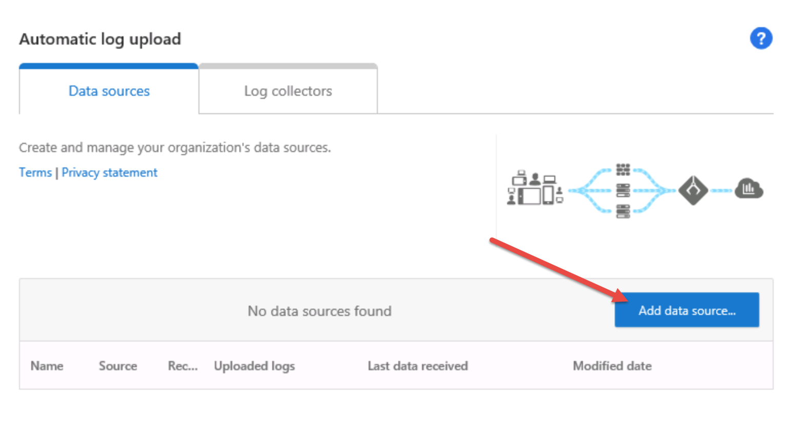

5. In the Add data source window, use the settings below (do not close the window yet):

    >|||
    >|---------|---------|
    >|Name| **SquiDLogs**|
    >|Source| **SQUID (Common)**|
    >|Receiver type| **FTP**|
    >|Anonymize private information |**Check the box**|
    >
    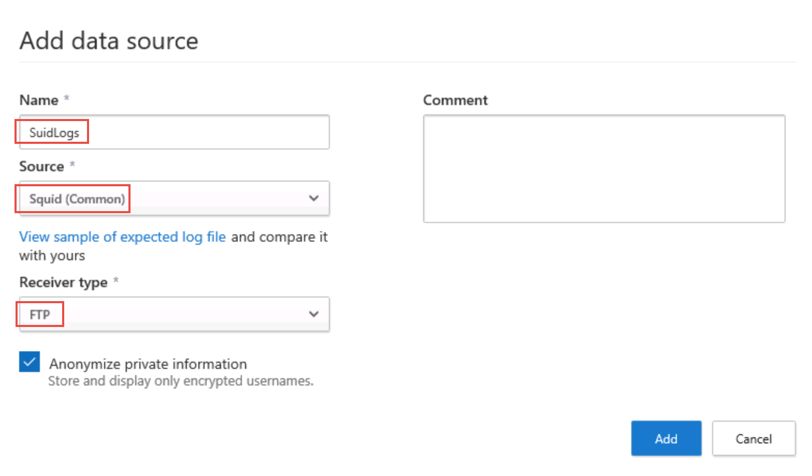

    >:memo: **NOTE:** In this lab we use FTP as the receiver type but usually companies will use Syslog.

6. While still in the Add data source dialog, click **View sample of expected log file**.

    >:memo: **NOTE:** Using this information, you can verify with your network team that the provided logs match the format expect by Cloud App Security. If it doesn't, you can should a custom parser.

    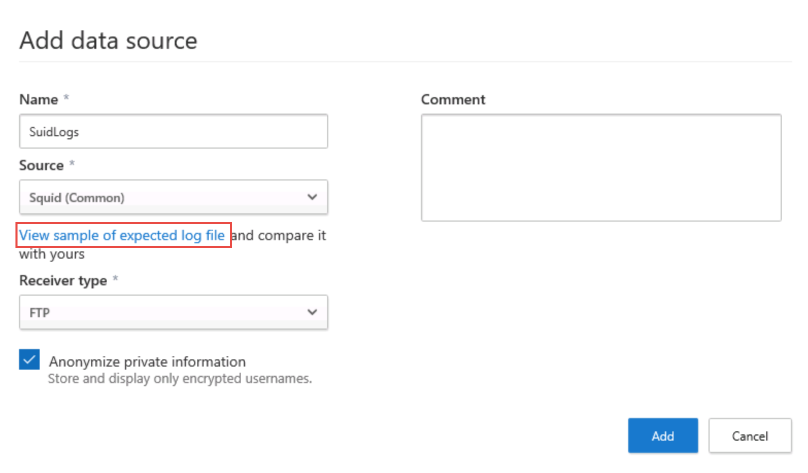

7. In the Verify your log format dialog, click **Download sample log** and save to your desktop. Those logs will be used to simulate an appliance sending traffic logs to the log collector.

    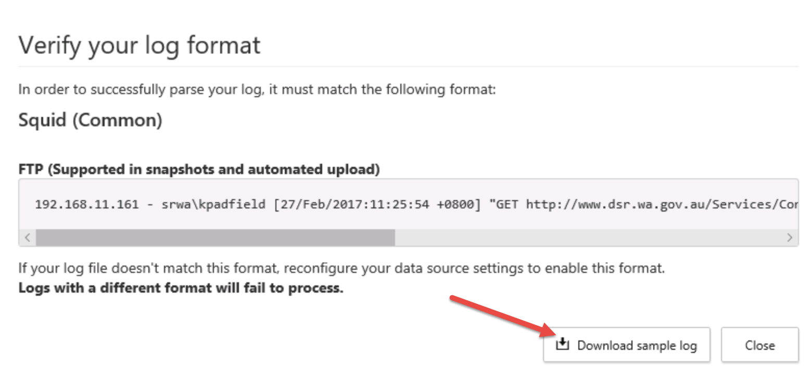

8. Close the *Verify your log format* window, then click **Add** in the **Add** data source dialog.

    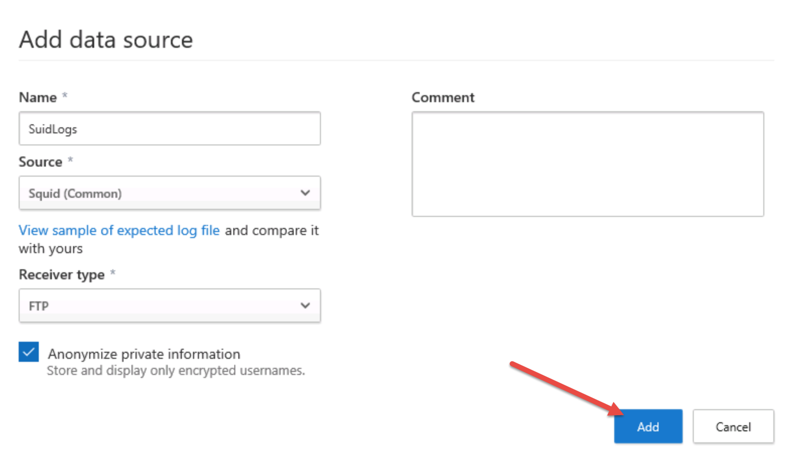

    >**INFO:** We just created a data source which is the logical representation of the network appliance data source type the log collector will receive.

9. Next, click on the **Log collectors tab** and click the **Add log collector...** button.

    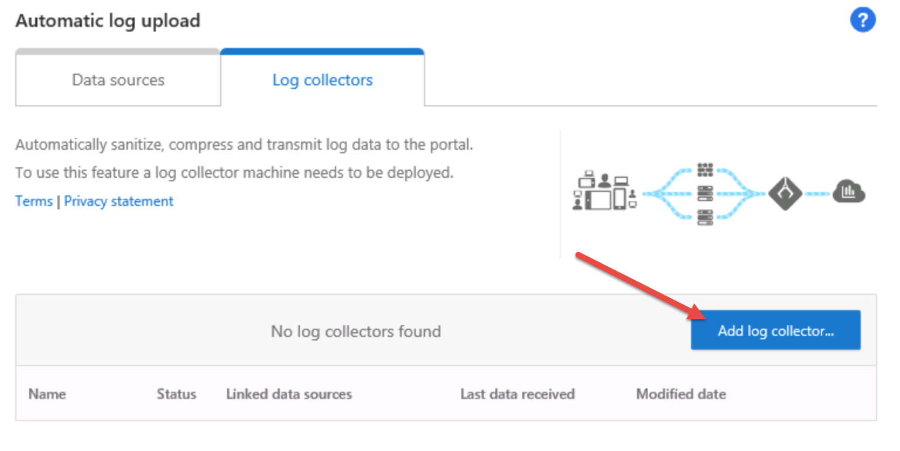

10. In the Create log collector dialog, provide the settings below and click the **Update** button.

    |||
    |-----|-----|
    |Name|**LogCollector**
    |Host IP address|**192.168.141.125**
    |Data source(s)|**SquidLogs**

    

11. After clicking on the **Update** button, you have now the required steps to create your log collector instance on **LinuxVM**.
    >:warning: Do not close this window!

    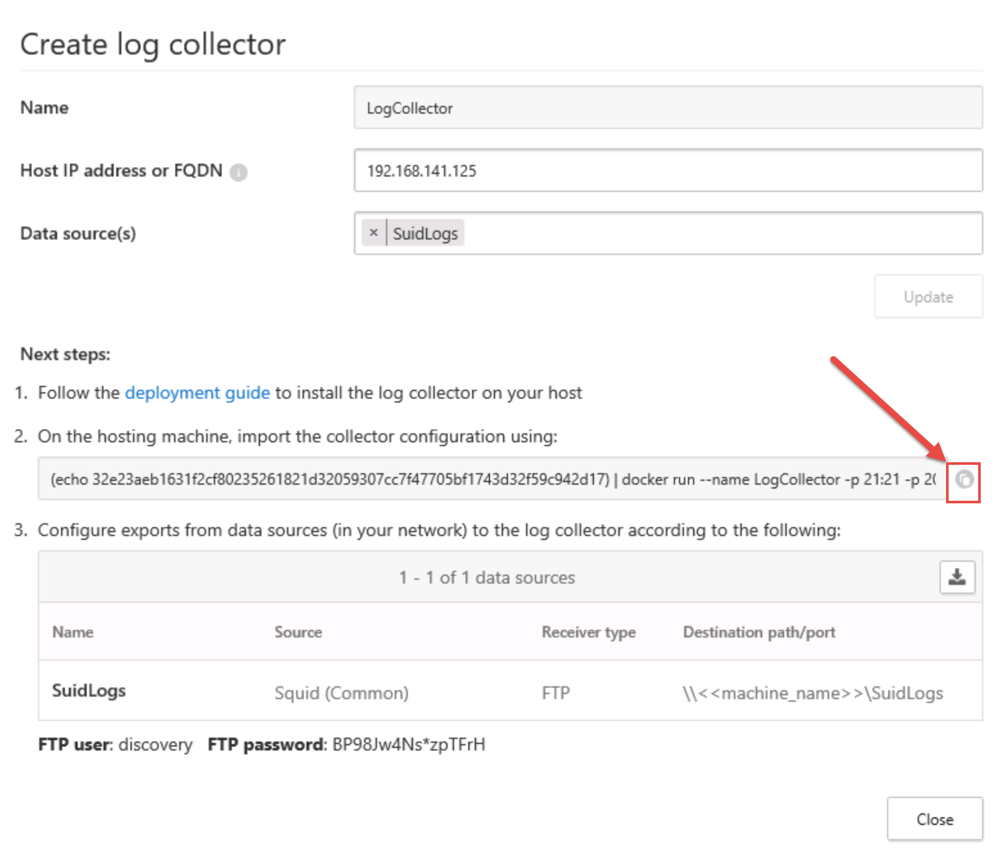

    ``` bash
    (echo 1f5b5fb2a0d778e3d57f26ca5ab11574db0751166477940528ccf19a7c4) | docker run --name LogCollector -p 21:21 -p 20000-20099:20000-20099 -e "PUBLICIP='192.168.141.125'" -e "PROXY=" -e "SYSLOG=false" -e "CONSOLE=xyztenant.eu.portal.cloudappsecurity.com" -e "COLLECTOR=LogCollector" --security-opt apparmor:unconfined --cap-add=SYS_ADMIN --restart unless-stopped -a stdin -i microsoft/caslogcollector starter
    ```

    >**INFO:** This command line contains the different parameters to instanciate a new log collector on the Linux host:
    >* An API token to connect to Cloud App Security for uploading the logs: *1f5b5fb2a0d778e3d57f26ca5ab11574db0751166477940528ccf19a7c4*
    >* The docker parameters to configure the log collector container: *docker run ...*

12. Copy the command line provided at the end of the previous step and **minimize** the browser. Open **Putty (64-bit)**. You should have the icon on your desktop.
    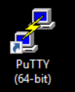

13. In the PuTTY Configuration window, enter **192.168.141.125** and click **Open**.

    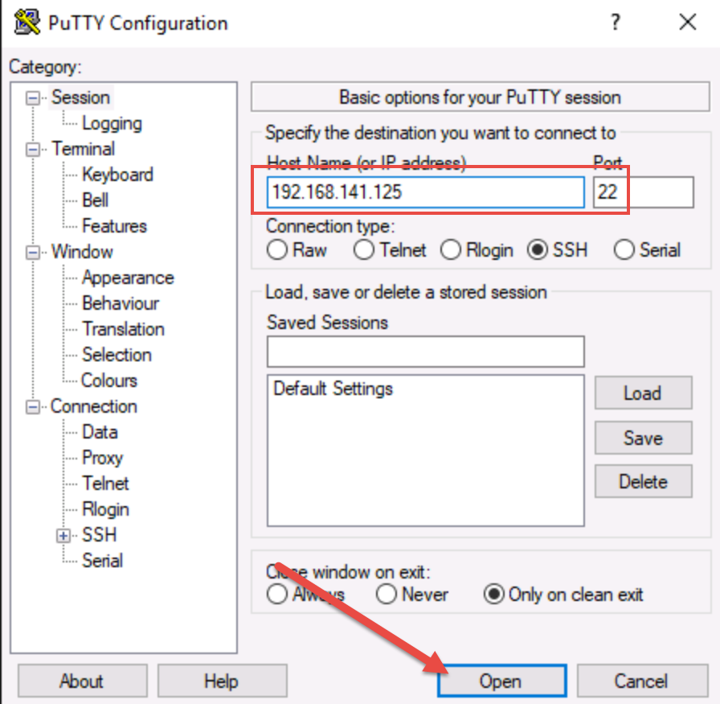

14. At the Putty warning message, click **Yes**.
    >**INFO:** This warning is due to the ssh certificate. You can safely ignore this warning in this lab.

    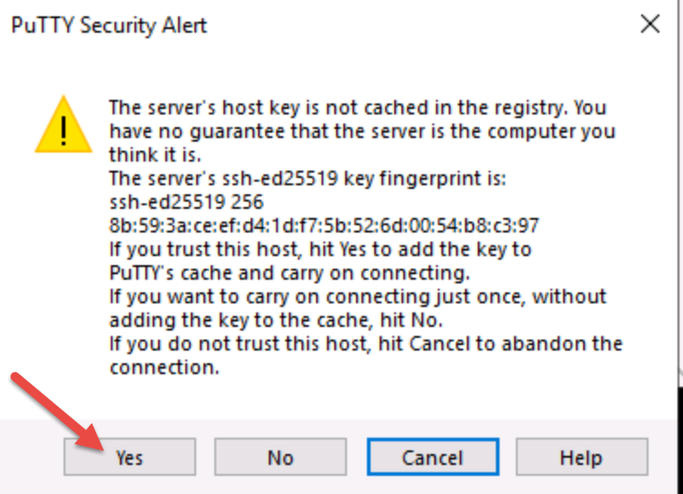

15. Log in using the credentials below.
    >|Username|Password|
    >|---|---|
    >|user01|Passw0rd1|
    >
    >:warning:The password doesn't appear in the command prompt, you can safely press enter to validate the credentials.

    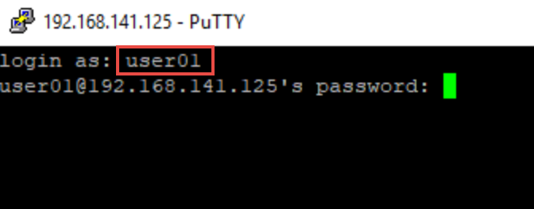

16. Type the command below and press **Enter**. Provide the user password when prompted.
    ``` bash
    sudo -i
    ```
    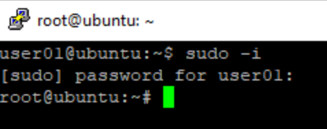
    >**INFO**: The previous command elevates your permissions in the Linux environment like the UAC prompt would do on a Windows machine.

17. Return to the *Create log collector* dialog, copy the **collector configuration** command from step 2 and run it in the PuTTY window.

    
    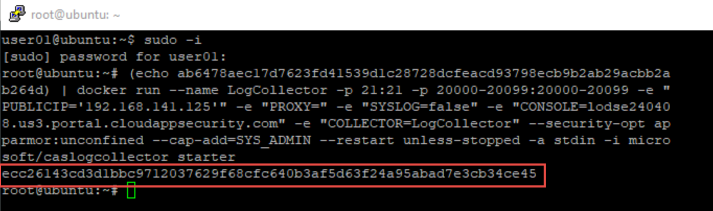
    >**INFO:** The output of this command is the id of the newly created container/log collector.

18. Now, launch **WinSCP** from the start-menu.

    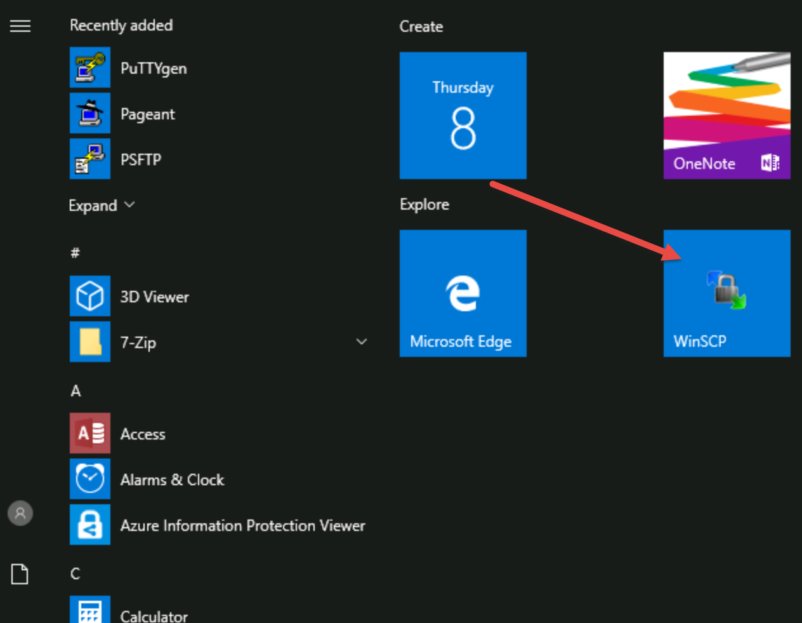

19. Use the details below in the WinSCP window to connect to the log collector FTP service.

    |File Protocol|Host name|User name|Password|
    |-----|-----|-----|-----|
    |FTP|192.168.141.125|discovery|BP98Jw4Ns*zpTFrH|

    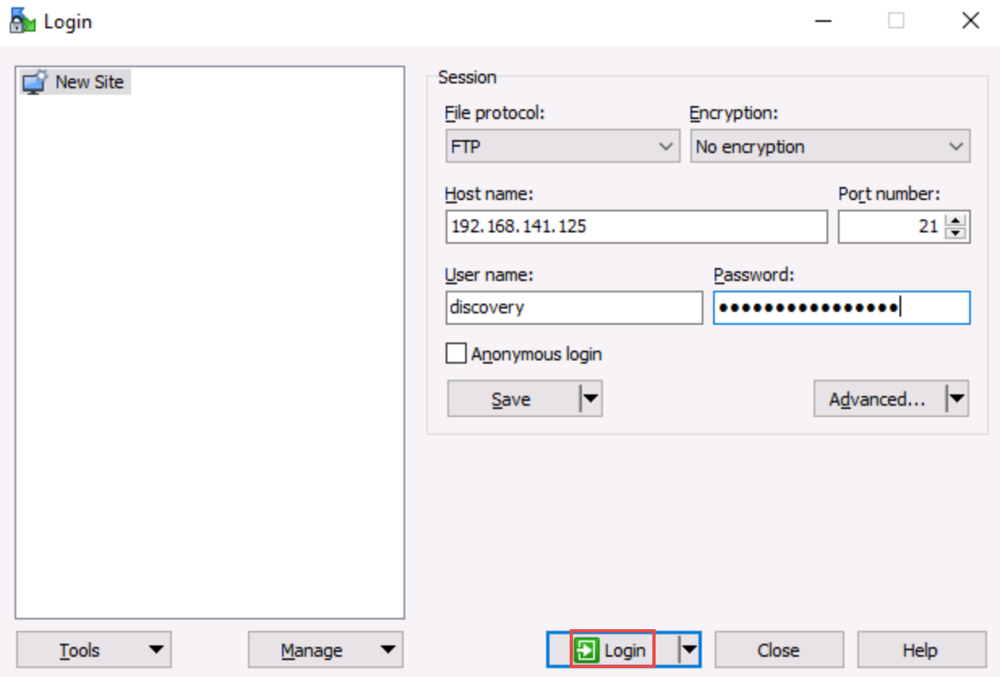

    >**INFO**: this information was provided during the log collector creation.
    >
    >:memo: **NOTE:** the password is common to every new log collector. To change it, follow [this guide](https://docs.microsoft.com/en-us/cloud-app-security/troubleshoot-docker#docker-deployment) in the documentation.

    You should then be able to see a folder with your data source name.

    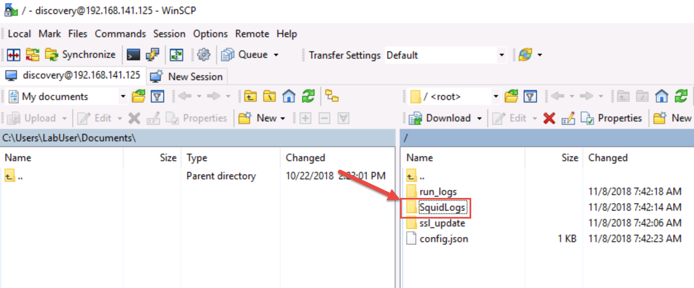

    >:warning: If you are **not** able to connect to the log collector FTP service, verify that you successfully created the new log collector instance within Putty in previous steps.

20. On the left pane, move to the **Desktop** folder and drag your demo Squid log into the folder named for your data source (**SquidLogs**). After some minutes, the log collector will upload your logs.

    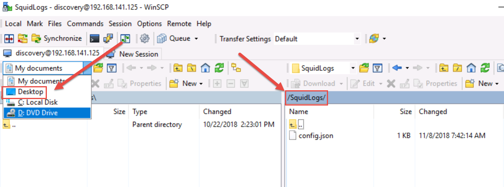
    
    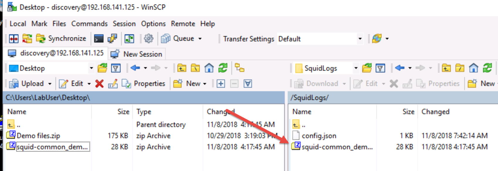

21. Return to the Cloud App Security portal and click on **Settings** > **Governance log**.

    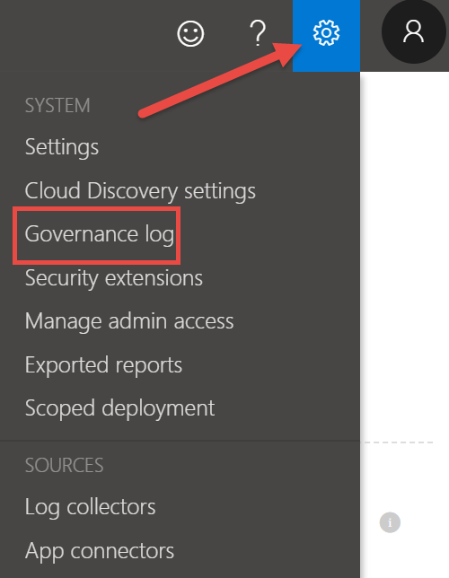

22. Verify the status of the uploaded logs.

    >**INFO:** The status you see is the parsing status of the logs. Parsing status can be successful, pending or failed.

    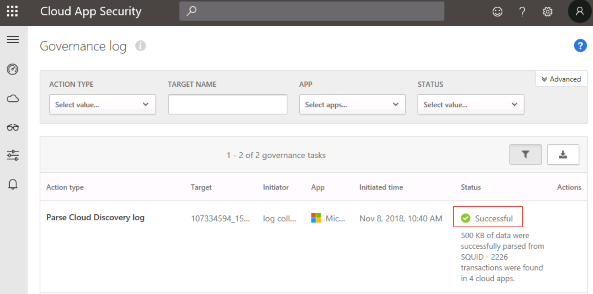

23. You can also verify the **last data received** status on the *Data sources* tab under **Automatic log upload** settings.

    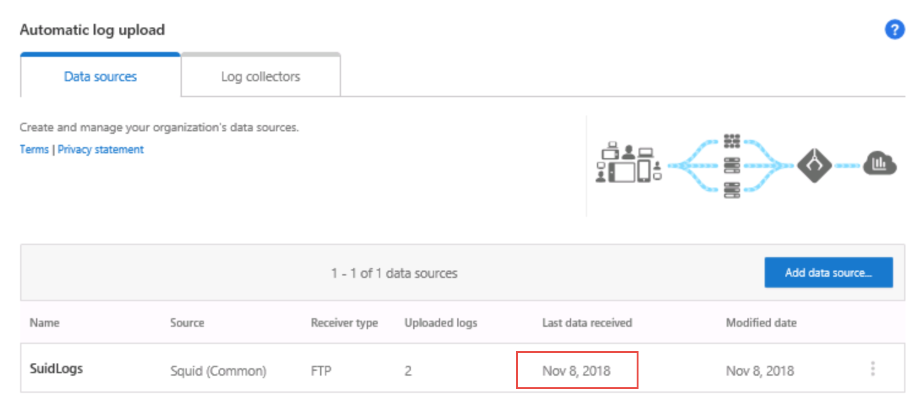

24. Go to the **Cloud Discovery dashboard** to verify the discovered apps.

    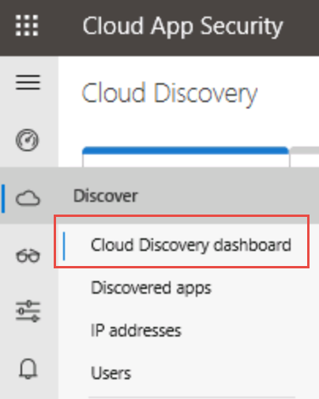

    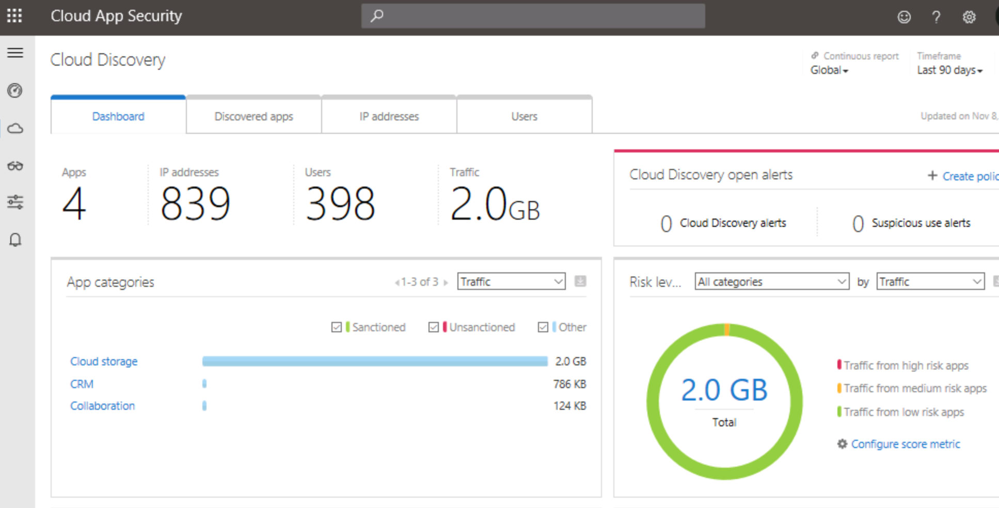

    >:memo: **NOTE:**  After validating that your logs have been successfully uploaded and processed by MCAS, you will not usually see directly the analysis of your data. Why?
    >
    >**ANSWER:** Cloud Discovery logs are only parsed **twice a day**.

---

## How to troubleshoot the Docker log collector

[:arrow_up: Top](#Cloud-App-Security-Discovery-lab)

In this task, you will review possible troubleshooting steps to identify issues in automatic logs upload from the log collector.
There are several things to test at different locations: in the log collector, in MCAS, at the network level.

### Useful commands

* `cd` : *Used to navigate in the directories*
    >**Examples:**
    >
    >`cd /var/adallom` : *to go to the specified directory*
    >
    >`cd /` : *to go to the root directory*
    >
    >`cd ..` : *to go to the parent directory*

* `more` or `cat` : *Used to display the content of the logs*
    > **Examples:**
    >
    >`more trace.log` : *to display the content of the trace.log file*

* `tail` : *Used for outputting the last part of files*

* `ll` : *Used to display the content of the directory as a list*. This command is an alias for `ls -l`

* `clear` : *Used to clear the screen*

* `tab key` : Used to perform autocompletion

### Verify the log collector (container) status

1. On **Client01**, open a session on PuTTY to **192.168.141.125** and use the credentials below.
    In the PuTTY Configuration window, enter **192.168.141.125** and click **Open**.

    

    Log in using the credentials below.
    >|Username|Password|
    >|---|---|
    >|user01|Passw0rd1|
    >
    >:warning:The password doesn't appear in the command prompt, you can safely press enter to validate the credentials.

2. Run the following commands:

    ``` bash
    sudo -i
    docker stats
    ```
    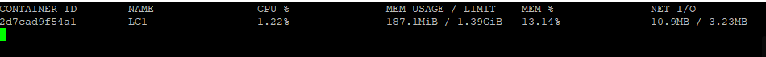

     >**INFO:** This command will show you the status of the log collector instance.

3. Press `Ctrl-C` to end the command.

4. Next, run the command below:

    ``` bash
    docker logs --details LogCollector
    ```
    

     >**INFO:** This command will show you the container logs to verify if it encountered errors when initiating.

### Verify the log collector logs

1. Type the following command:

    ``` bash
    docker exec -it LogCollector bash
    ```
     >**INFO:** This command will execute the container's bash. You will then be able to execute commands *from inside* of the log collector.

2. You can now explore the container filesystem and inspect the **/var/adallom** directory. This directory is where you will investigate most of the issues with the syslog or ftp logs being sent to the log collector.

    ``` bash
    cd /var/adallom
    ll
    ```

    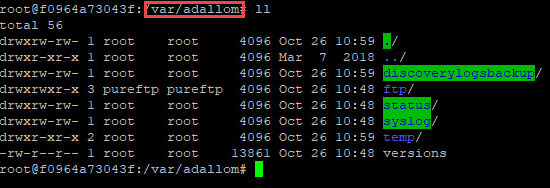

    Go to the following folders and review their log files using `more`:
    * **/adallom/ftp/discovery**: this folder contains the data source folders where you send the log files for automated upload. This is also the default folder when logging into the collector with FTP credentials.
    * **/adallom/syslog/discovery**: if you setup the log collector to receive syslog messages, this is where the flat file of aggregated messages will reside until it is uploaded.
    * **/adallom/discoverylogsbackup**: this folder contains the last file that was sent to MCAS. This is useful for looking at the raw log in case there are parsing issues.

3. To validate that logs are correctly received from the network appliance, you can also verify the **/var/log/pure-ftpd** directory and check the transfer log:

    ``` bash
    tail transfer.log
    ```

    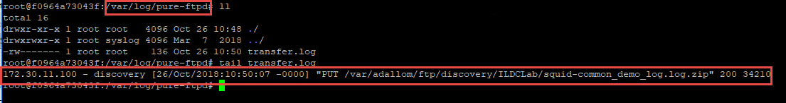

4. Now, move to the **/var/log/adallom** directory.

    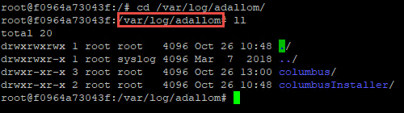

    Go to the following folders and review their content and log files using `ll` and `more` or `tail`:
    * **/var/log/adallom/columbus**: this folder is where you will find log files useful for troubleshooting issues with the collector sending files to Cloud App Security. In the **log-archive** folder you can find previous logs compressed as *.tar.gz* files that could be used to send to support for example.
    * **/var/log/adallom/columbusInstaller**: this is where you will investigate issues with the log collector itself. You will find here logs related to the configuration and bootstrapping of the collector. For example, **trace.log** will show you the bootstrapping process:

    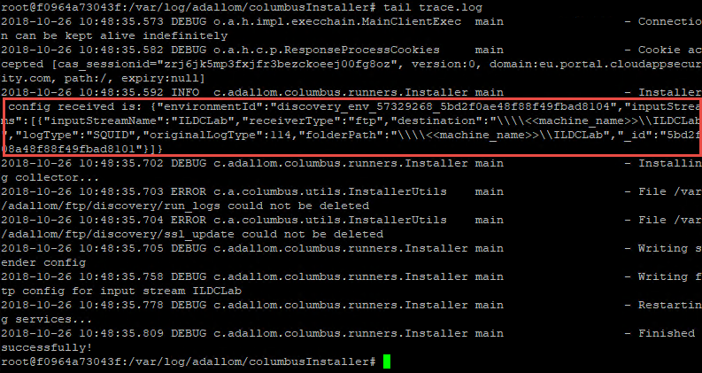

### Verify the connectivity between the log collector and Cloud App Security

An easy way to test the connectivity after configuring the log collector is to download a sample of your appliance logs from and use WinSCP to connect to the log collector to upload it and see if it gets uploaded to Cloud App Security, as you did in the previous exercise

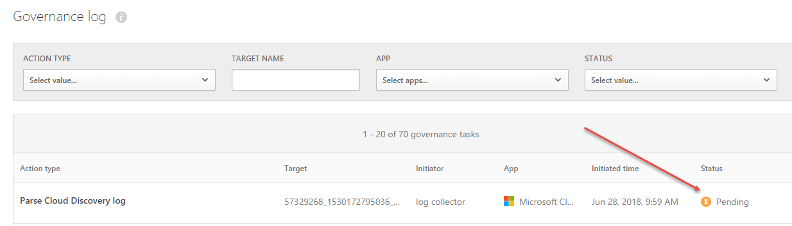

>:memo: **NOTE:**  If the log stays in the source folder for too long, then you know you probably have a connection issue between the log collector and Cloud App Security and should go investigate the logs reviewed previously.