# Cloud Discovery
[🔙](#microsoft-365-cloud-app-security)

### Estimated time to complete
30 min

Continuous reports in Cloud Discovery analyze all logs that are
forwarded from your network using Cloud App Security. They provide
improved visibility over all data, and automatically identify anomalous
use using either the Machine Learning anomaly detection engine or by
using custom policies that you define.
To use this capability, you will perform in this lab the configuration
and troubleshooting of the Cloud Discovery feature.

> NOTE: The Docker engine has been pre-installed on LinuxVM using the commands at [https://docs.microsoft.com/en-us/cloud-app-security/discovery-docker-ubuntu](https://docs.microsoft.com/en-us/cloud-app-security/discovery-docker-ubuntu)
---
## Configure and test continuous reports
[🔙](#microsoft-365-cloud-app-security)

1. Switch to Client01.

1. Create a new tab in the InPrivate window and browse to **https://portal.cloudappsecurity.com**.

	>INFO: If necessary, log in using the credentials below:
	>
	>**Global Admin Username**
	>
	>**Global Admin Password**

1. In the Cloud App Security dashboard, click on the **Settings** icon and click **Log collectors**.

	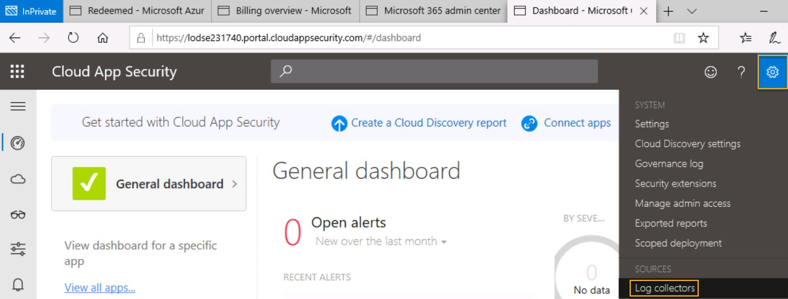
1. On the **Data sources tab**, click the **Add data source...** button.

	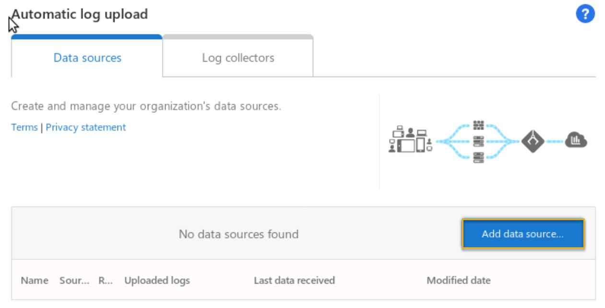
1. In the Add data source window, use the settings below:

	>|||
	>|---------|---------|
	>|Name| **Logs**|
    >|Source| **SQUID (Common)**|
	>|Receiver type| **FTP**|
	>|Anonymize private information |**Check the box**|
	>
	>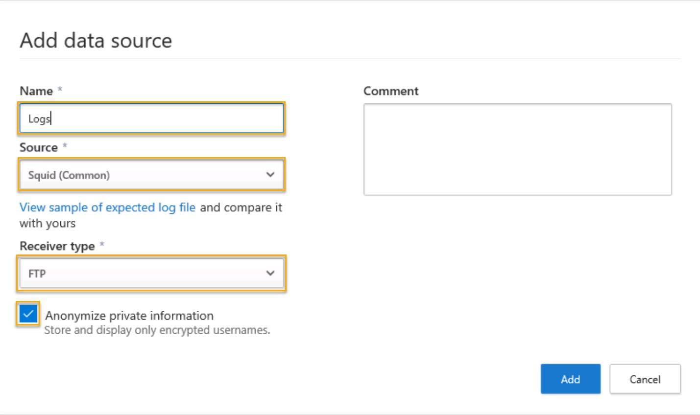

1. While still in the Add data source dialog, click **View sample of expected log file**.

	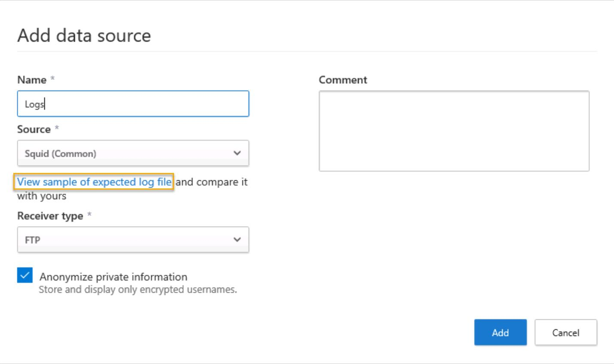
1. In the Verify your log format dialog, click **Download sample log** and save to your desktop.

	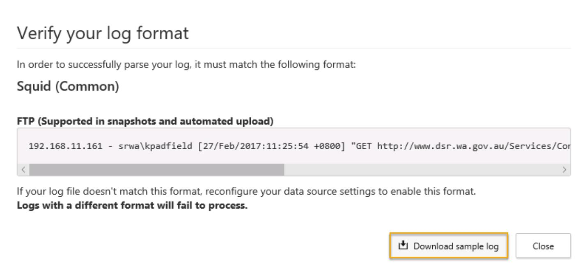
1. Minimize the browser and extract the sample log to your desktop.
1. Return to the browser and close the Verify your log format window, then click **Add** in the Add data source dialog.

	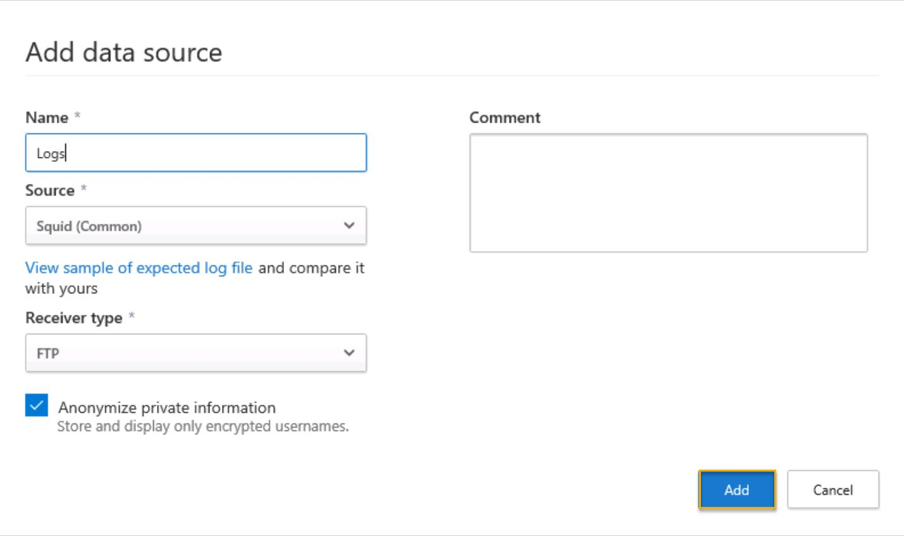
1. Next, click on the **Log collectors tab** and click the **Add log collector...** button.

	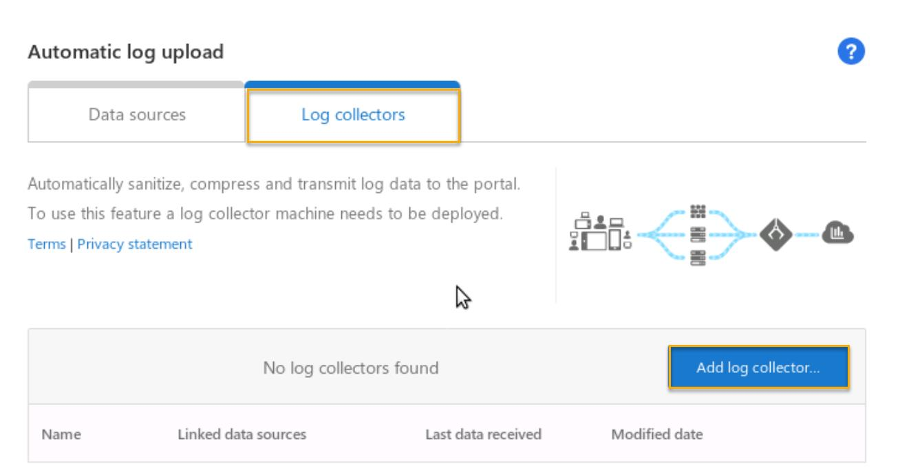
1. In the Create log collector dialog, provide the settings below and click the **Update** button.

	|||
	|-----|-----|
	|Name|**LogCollector**
	|Host IP address|**192.168.141.125**
	|Data source(s)|**Logs**

	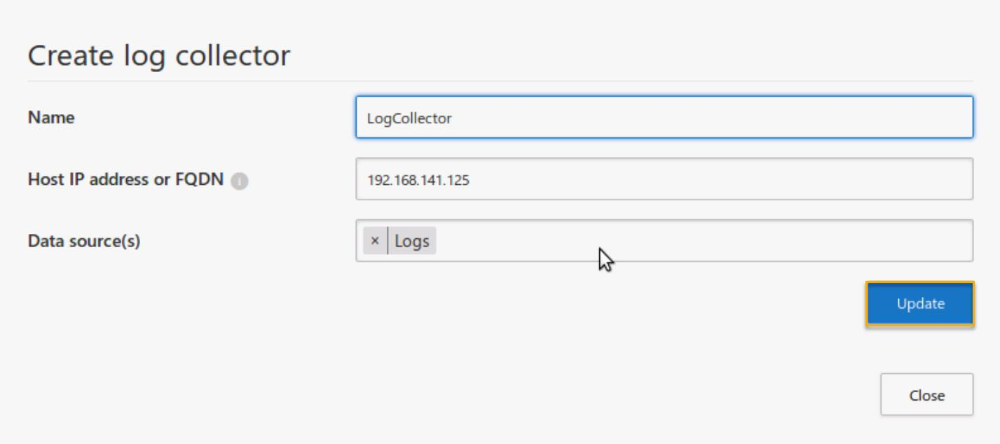
	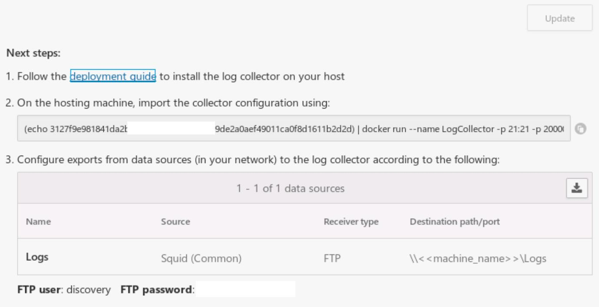
	
	> WARNING: Do not dismiss this window!
1. **Minimize** the browser and double-click **Putty (64-bit)** on the desktop.

1. In the PuTTY Configuration window, enter **192.168.141.125** and click **Open**.

	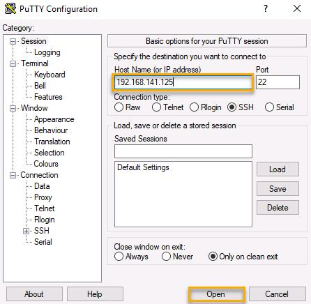
1. Log in using the credentials below.

	**user01**

	**Passw0rd1**

1. Type the command below and press **Enter**.

	```
	sudo -i
	```
1. Next, return to the Create log collector dialog and copy the **collector configuration** comannd from step 2 and run it in the PuTTY window.

	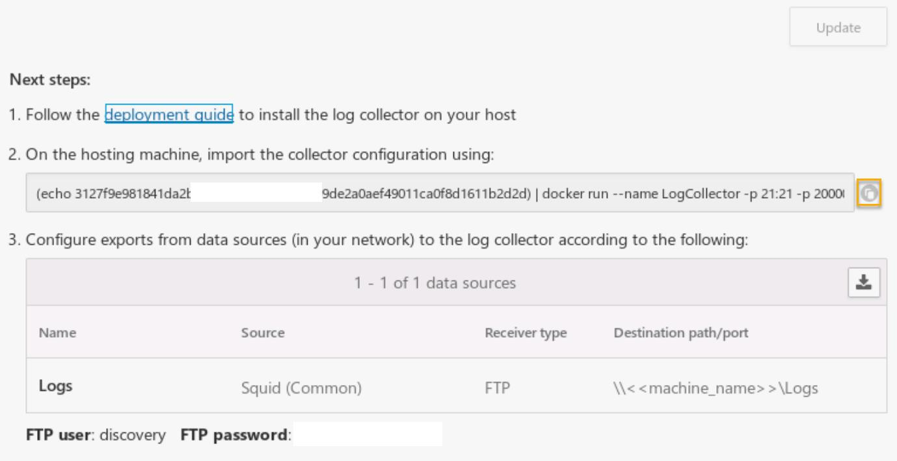
1. Next, launch **WinSCP** from the start-menu.

	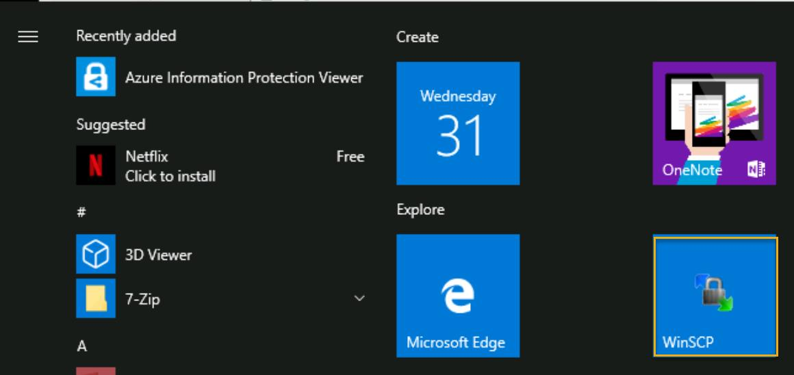
1. Enter the details below in the WinSCP window:
	|||
	|-----|-----|
	|File Protocol|**FTP**|
	|Host name|**192.168.141.125**|
	|User name|**discovery**|
	|Password|**BP98Jw4Ns*zpTFrH**|

1. Switch to the **Desktop** folder on the left side and double-click on the folder named for your data source (**Logs**).

	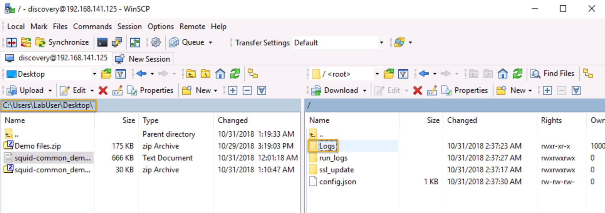
1. Select the squid-common demo log and click **Upload**.

	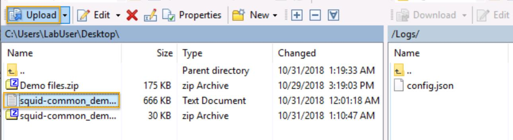
1. In the Upload dialog, click **OK**.

	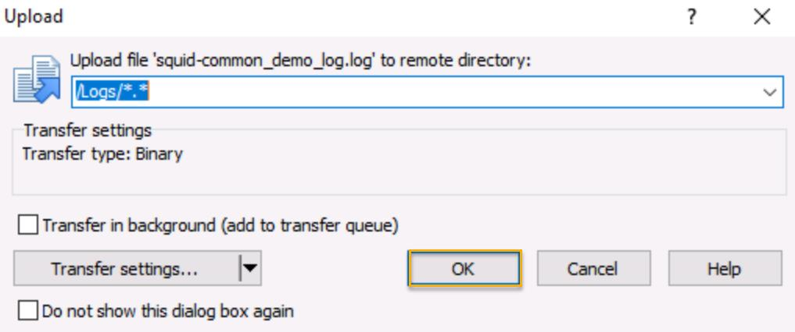

1. After uploading your logs, return to the MCAS protal and click on **Settings** > **Governance log**. 

	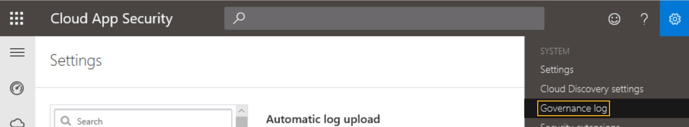
	
1. You may also verify the **last data received** status on the Data sources tab under **Automatic log upload**.

	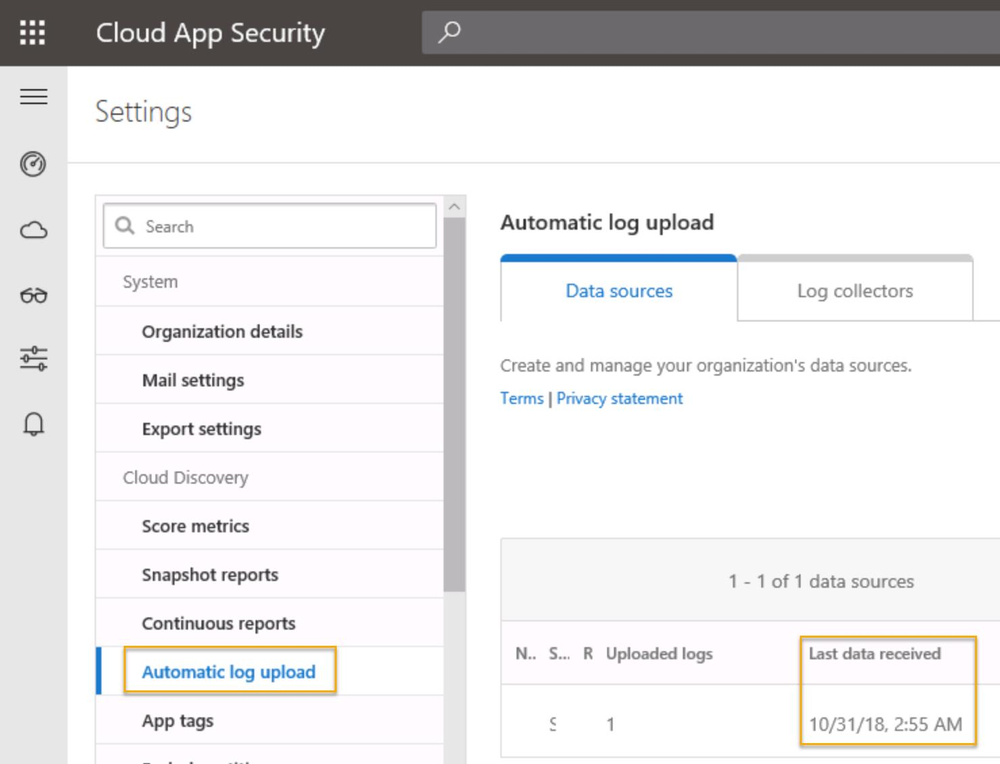

	> NOTE:  After validating that your logs have been successfully uploaded and
    processed by MCAS, you will not see directly the analysis of your
    data. Why? (hint: verify the "Set up Cloud Discovery" documentation
    page).

---
## How to troubleshoot the Docker log collector
[🔙](#microsoft-365-cloud-app-security)

In this task, you will review possible troubleshooting steps to identify
issues in automatic logs upload from the log collector.

There are several things to test at different locations: in the log
collector, in MCAS, at the network level.

### Useful commands
	
- To navigate in the directories, use the "cd" command.
	Examples: 

	**cd /var/adallom** to go to the specified directory

	**cd /** to go to the root directory

	**cd ..** to go to the parent directory
	
- To display the content of the logs, use the **more file_name** command
- To display the content of the directory, use the **ll** command
- To clear the screen, use the **clear** command

- For saving typing, use the **Tab** key and perform autocompletion.

### Verify the log collector (container) status

1. On Client01, open a session on PuTTY to **192.168.141.125** and use the credentials below.

	**user01**

	**Passw0rd1**

1. Run the following commands:

	```
	sudo -i
	```
	```
	docker stats
	```
	This command will show you the status of the log collector instance:

	
1. Press **Ctrl-C** to end the command. 
1. Next, run the command below:

	```
	docker logs --details LogCollector
	```

	This command will show you the logs from the log collector to verify if
	it encountered errors when initiating:


	![rootaubuntu-srt: \'hame,\'seb 5 \--dzt.ei15 Setting ftp configuration
	Enter again: Setting syslog Reading configuration.. . Installing
	collector successfully! zenzitive Starting 2018-06-28 2018-06-28
	2018-06-28 2010-06-28 2018-06-28 08 2018-06-28 2018-06-28 seo 2018-06-28
	53B 2018-06-28 €67 2018-06-28 2018-06-28 667 08:28: is, CRIT WARN I NEO
	CR IT I NEO 1 NEO INFO I NEO INSO I NEO INFO I NEO INFO as uzez in file)
	during parsing RBC interface \' supervisor • initialized http without
	HTTP checking Started With pid 1059 spawned: spawned : success : • with
	1062 •rsyslog• with pid 1063 with pid 2064 • Columbus\' with 1065
	rsyslog RUNNING stace, ftpd entered RUNNING state, pza RUNNING scat\* ,
	Stayed up for](4bfomeag.jpg)

	 

#### To go further in the troubleshooting, you can connect to the log collector container to investigates the different logs.

1. Type the following command:

	```
	docker exec -it LogCollector bash
	```

1. You can then explore the container filesystem and inspect the
	**/var/adallom** directory. This directory is where you will investigate
	issues with the syslog or ftp logs being sent to the collector

	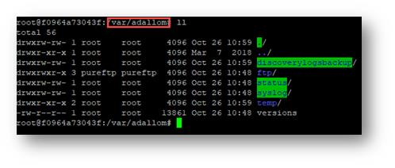

-   **/adallom/ftp/discovery**: this folder contains the data source
    folders where you send the log files for automated upload. This is
    also the default folder when logging into the collector with FTP
    credentials.

-   **/adallom/syslog/discovery**: if you setup the log collector to
    receive syslog messages, this is where the flat file of aggregated
    messages will reside until it is uploaded.

-   **/adallom/discoverylogsbackup**: this folder contains the last file
    that was sent to MCAS. This is useful for looking at the raw log in
    case there are parsing issues.

1. To validate that logs are correctly received from the network appliance,
you can also verify the **/var/log/pure-ftpd** directory and check the
transfer log:

	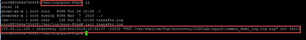

1. Now, move to the **/var/log/adallom** directory.

	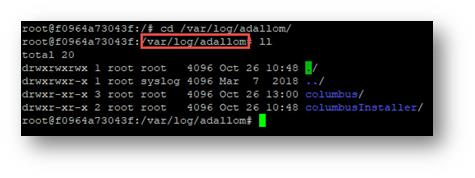

-   **/var/log/adallom/columbus**: this folder is where you will find
    log files useful for troubleshooting issues with the collector
    sending files. In the log-archive folder you can copy previous logs
    compressed as .tar.gz files off the collector to send to support.

-   **/var/log/adallom/columbusInstaller**: this is where you will
    investigate issues with the collector itself. You will find here
    logs related to the configuration and bootstrapping of the
    collector. For example, trace.log will show you the bootstrapping
    process:

    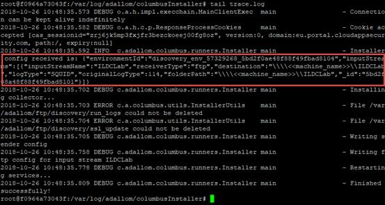

 


### Verify the connectivity between the log collector and MCAS

An easy way to test this is to download a sample of your appliance logs
from MCAS and use WinSCP to connect to the log collector to upload that
log and see if it gets uploaded to MCAS.

 

1. Upload the logs in the folder named by your source:

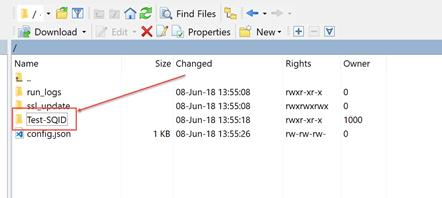

 

1. Then, check in MCAS the status:

	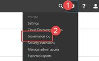

 

	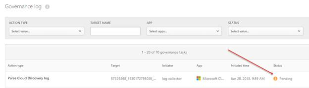

 

	> NOTE: If the log stays in the source folder, then you know you probably have a
connection issue between the log collector and MCAS.

Another way to validate the connection is to log into the container like
in the previous task and then run *netstat -a* to check if we see
connections to MCAS:

1. In the PuTTY window, type the command below:

	```
	netstat -a
	```
	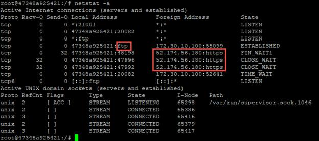
