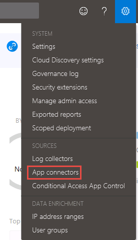
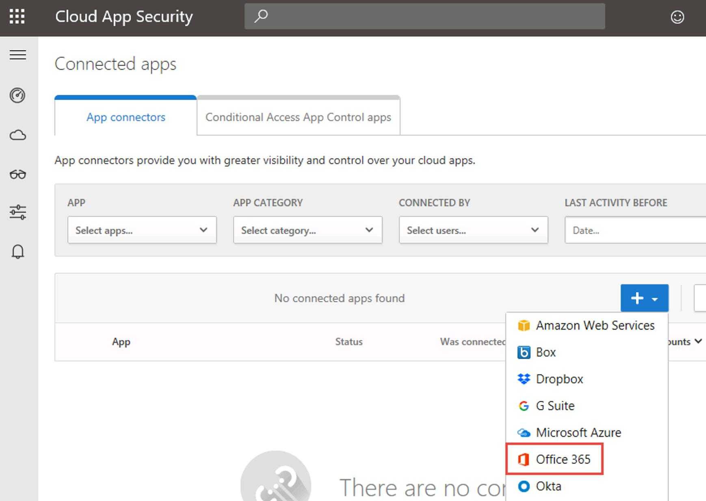
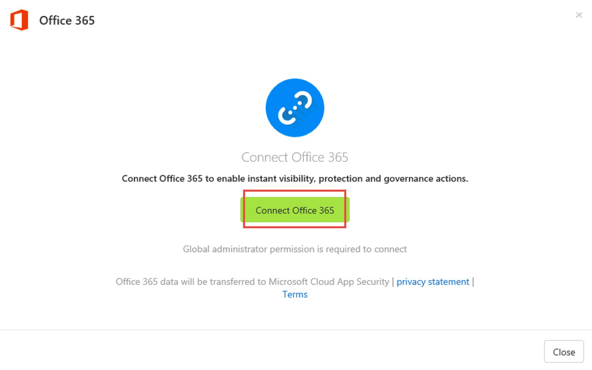
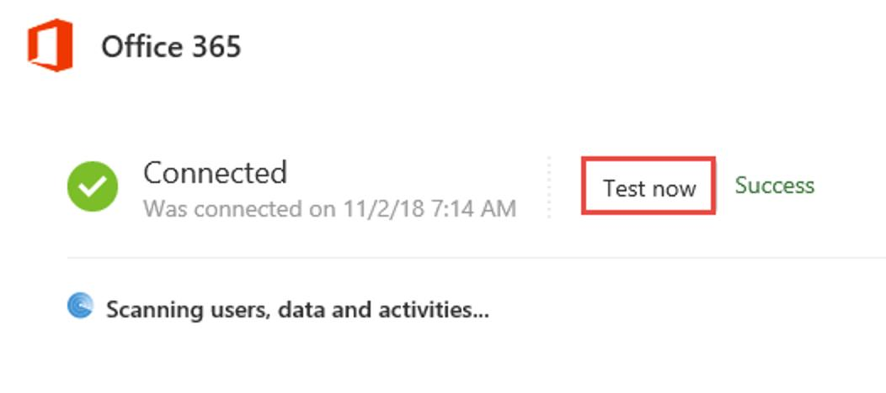
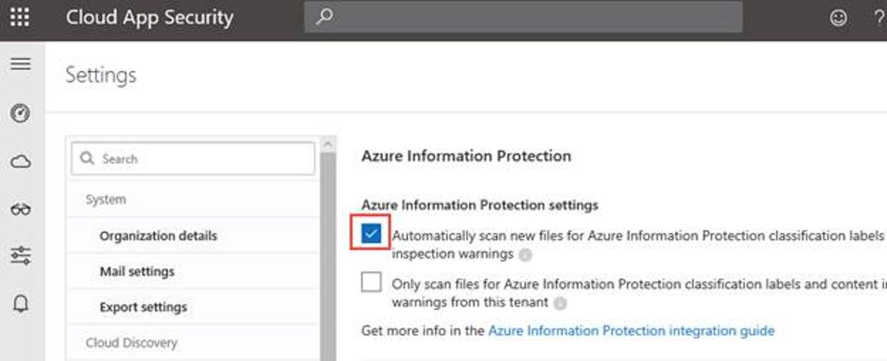

# Environment preparation

[:arrow_left: Home](./README.md)

## Connect Office 365 to Cloud App Security

[:arrow_up: Top](#Environment-preparation)

1. On Client01, open a new tab and go to **https://portal.cloudappsecurity.com**

2. Go to the gear icon and select **App connectors**

    

3. Click on the **+** button and select Office 365

    

4. Click on **Connect Office 365**

    
5. Click on **Test now** to validate the configuration

    

---

## Enabling Office 365 auditing

[:arrow_up: Top](#Environment-preparation)

TO DO

---

## Enabling Azure Information Protection integration

[:arrow_up: Top](#Environment-preparation)

As explained in the [documentation](https://docs.microsoft.com/en-us/cloud-app-security/azip-integration), configure the integration between the two solutions. 

1. Go to Cloud App Security settings and check the **Automatically scan new files** checkbox.

	
2.  Click on the **Save** button.

>:memo: It takes up to **1h** for Cloud App Security to sync the Azure Information classifications.