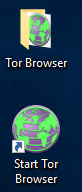

# Cloud App Security threat detection lab

Cloud App Security provides several [threats detection policies](https://docs.microsoft.com/en-us/cloud-app-security/anomaly-detection-policy) using machine learning and **user behavior analytics** to detect suspicious activities across your different applications.
Those policies are enabled by default and after an initial learning period, Cloud App Security will start alerting you when suspicious actions like activity from anonymous IP addresses, infrequent country, suspicious IP addresses, impossible travel, ransomware activity, suspicious inbox forwarding configuration or unusual file download are detected.
In this lab, we will perform some malicious actions that Cloud App Security will detect. As some detections require learning about your users’ behavior, we will focus on the ones you can simulate during this lab.

## Prerequisites

### Tools

To simulate user access from anonymous IPs, we will use TOR browser.
Go to the [TOR project website](https://www.torproject.org/projects/torbrowser.html.en#downloads) to download the Windows version and install it.
You should find the shortcut on your desktop:

### Environment

URL’s:
Office 365: https://portal.office.com
Cloud App Security: https://portal.cloudappsecurity.com
	Windows Defender ATP: https://securitycenter.windows.com
Users:
	Administrator
Username: admin@paris18.onmicrosoft.com 
Password: ParisPassword1
	Adele Vance
Username: adelev@paris18.onmicrosoft.com
Password: ParisPassword1
	Megan Bowens
Username: meganb@paris18.onmicrosoft.com
Password: ParisPassword1
